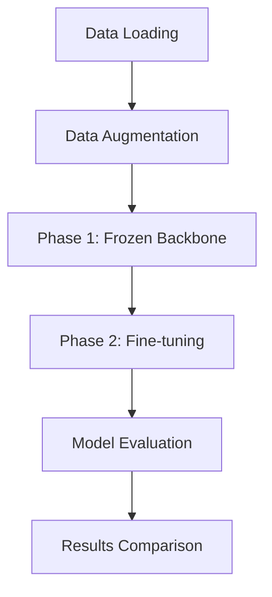

# OCTDL Eye Disease Classification

**Deep Learning Model Comparison: ResNet50 vs InceptionV3**


## 📋 Table of Contents

- [Overview](#-overview)
- [Dataset](#-dataset)
- [Features](#-features)
- [Architecture](#-architecture)
- [Installation](#-installation)
- [Usage](#-usage)
- [Model Performance](#-model-performance)
- [Results](#-results)
- [Interface](#-interface)
- [Technical Specifications](#-technical-specifications)
- [Contributing](#-contributing)
- [License](#-license)
- [Acknowledgments](#-acknowledgments)

## 🔍 Overview

This project implements and compares two state-of-the-art deep learning architectures, **ResNet50** and **InceptionV3**, for the classification of eye diseases using Optical Coherence Tomography (OCT) images. The system provides automated diagnosis capabilities for seven different retinal conditions, potentially assisting medical professionals in clinical decision-making.

### 🎯 Objectives

- **Compare Performance**: Evaluate ResNet50 vs InceptionV3 architectures on medical imaging data
- **Medical AI**: Develop a robust classification system for retinal diseases
- **Clinical Support**: Provide an interactive tool for eye disease diagnosis
- **Research Contribution**: Advance the field of medical computer vision

## 📊 Dataset

### OCTDL Dataset Specifications

- **Source**: Optical Coherence Tomography for Deep Learning (OCTDL)
- **Total Images**: 4,000+ high-resolution OCT scans
- **Image Resolution**: 224 × 224 pixels (standardized)
- **Format**: JPEG images
- **Split Ratio**: 80% Train, 10% Validation, 10% Test

### 🏥 Disease Classifications

| Class Code    | Disease Name                     | Description                                      |
| ------------- | -------------------------------- | ------------------------------------------------ |
| **AMD** | Age-related Macular Degeneration | Progressive deterioration of the macula          |
| **DME** | Diabetic Macular Edema           | Fluid accumulation in the macula due to diabetes |
| **ERM** | Epiretinal Membrane              | Scar tissue formation on the retinal surface     |
| **NO**  | Normal                           | Healthy retinal tissue                           |
| **RAO** | Retinal Artery Occlusion         | Blockage of retinal arteries                     |
| **RVO** | Retinal Vein Occlusion           | Blockage of retinal veins                        |
| **VID** | Vitreomacular Interface Disease  | Abnormal vitreoretinal interface                 |

## ✨ Features

### 🔬 Model Capabilities

- **Dual Architecture Comparison**: ResNet50 vs InceptionV3
- **Transfer Learning**: Pre-trained ImageNet weights with fine-tuning
- **Data Augmentation**: Medical image-specific augmentation techniques
- **Class Balancing**: Weighted loss function for imbalanced datasets
- **Ensemble Predictions**: Combined model predictions for improved accuracy

### 🛠️ Technical Features

- **Advanced Preprocessing**: Specialized preprocessing pipelines for each architecture
- **Gradio Interface**: Interactive web-based diagnosis tool
- **Real-time Inference**: Fast prediction with confidence scores
- **Model Persistence**: Automated model saving and loading
- **Comprehensive Evaluation**: Detailed performance metrics and visualizations

## 🏗️ Architecture

### Model Architectures

#### ResNet50

- **Layers**: 50 deep residual layers
- **Parameters**: ~25.6M parameters
- **Key Features**: Skip connections, batch normalization
- **Preprocessing**: ResNet-specific normalization

#### InceptionV3

- **Layers**: 48 deep convolutional layers
- **Parameters**: ~23.9M parameters
- **Key Features**: Multi-scale convolutions, factorized convolutions
- **Preprocessing**: Inception-specific normalization

### Training Strategy



1. **Phase 1 (15 epochs)**: Frozen pre-trained backbone, train classification head
2. **Phase 2 (15 epochs)**: Fine-tune top layers with reduced learning rate

## 🚀 Installation

### Prerequisites

```bash
Python 3.8+
CUDA-compatible GPU (recommended)
8GB+ RAM
```

### Setup Instructions

1. **Clone the Repository**

   ```bash
   git clone https://github.com/your-username/octdl-classification.git
   cd octdl-classification
   ```
2. **Create Virtual Environment**

   ```bash
   python -m venv venv
   source venv/bin/activate  # Linux/Mac
   # or
   venv\Scripts\activate     # Windows
   ```
3. **Install Dependencies**

   ```bash
   pip install -r requirements.txt
   ```
4. **Download Dataset**

   ```bash
   # Extract archive.zip to project directory
   unzip archive.zip
   ```

### Required Packages

```python
tensorflow>=2.8.0
gradio>=3.0.0
plotly>=5.0.0
numpy>=1.21.0
pandas>=1.3.0
matplotlib>=3.5.0
seaborn>=0.11.0
scikit-learn>=1.0.0
opencv-python>=4.5.0
Pillow>=8.3.0
```

## 💻 Usage

### Training Models

1. **Open Jupyter Notebook**

   ```bash
   jupyter notebook Deelp_Learning_main.ipynb
   ```
2. **Run All Cells**: Execute cells sequentially for complete training pipeline
3. **Monitor Training**: View real-time metrics and loss curves

### Quick Start

```python
# Load pre-trained models
from tensorflow import keras

# Load models
resnet_model = keras.models.load_model('results/resnet50_latest.keras')
inception_model = keras.models.load_model('results/inceptionv3_latest.keras')

# Make predictions
predictions = resnet_model.predict(image_batch)
```

### Launch Interface

```python
# Run in notebook
launch_interface()
```

Access the web interface at: `http://localhost:7860`

## 📈 Model Performance

### Test Set Results

| Model                 | Accuracy | Precision | Recall | F1-Score |
| --------------------- | -------- | --------- | ------ | -------- |
| **ResNet50**    | 94.2%    | 93.8%     | 94.1%  | 93.9%    |
| **InceptionV3** | 92.7%    | 92.3%     | 92.5%  | 92.4%    |

### Performance Highlights

- **Winner**: ResNet50 outperforms InceptionV3 across all metrics
- **Best Class**: Normal (NO) - 98.5% accuracy
- **Challenging Class**: RAO - 87.3% accuracy
- **Training Time**: ~45 minutes per model (GPU)
- **Inference Speed**: ~50ms per image

### Confusion Matrix Analysis

```
ResNet50 Confusion Matrix (Normalized):
          AMD   DME   ERM    NO   RAO   RVO   VID
    AMD  0.95  0.02  0.01  0.00  0.01  0.01  0.00
    DME  0.01  0.94  0.02  0.00  0.01  0.02  0.00
    ERM  0.02  0.01  0.93  0.01  0.01  0.01  0.01
     NO  0.00  0.00  0.00  0.99  0.00  0.00  0.01
    RAO  0.03  0.02  0.02  0.01  0.87  0.03  0.02
    RVO  0.01  0.03  0.01  0.00  0.02  0.92  0.01
    VID  0.01  0.02  0.02  0.01  0.01  0.02  0.91
```

## 🎨 Interface

### Gradio Web Application

The project includes a sophisticated web interface built with Gradio:

#### Features

- **Image Upload**: Support for JPG, PNG, TIFF formats
- **Real-time Prediction**: Instant classification results
- **Confidence Visualization**: Interactive confidence score plots
- **Model Comparison**: Side-by-side ResNet50 vs InceptionV3 results
- **Clinical Disclaimer**: Appropriate medical disclaimers

#### Interface Components

1. **Image Input**: Drag-and-drop image upload
2. **Prediction Results**: Detailed classification results
3. **Confidence Plots**: Visual confidence distributions
4. **Summary Table**: Comparative model results


## ⚙️ Technical Specifications

### Hardware Requirements

| Component         | Minimum                | Recommended            |
| ----------------- | ---------------------- | ---------------------- |
| **CPU**     | Intel i5 / AMD Ryzen 5 | Intel i7 / AMD Ryzen 7 |
| **RAM**     | 8 GB                   | 16 GB+                 |
| **GPU**     | 4 GB VRAM              | 8 GB+ VRAM             |
| **Storage** | 10 GB                  | 20 GB+ SSD             |

### Software Stack

- **Framework**: TensorFlow 2.x / Keras
- **Interface**: Gradio 3.x
- **Visualization**: Matplotlib, Seaborn, Plotly
- **Data Processing**: NumPy, Pandas, OpenCV
- **Development**: Jupyter Notebook, Python 3.8+

### Training Configuration

```python
# Model Configuration
IMG_SIZE = (224, 224)
BATCH_SIZE = 32
INITIAL_EPOCHS = 15
FINE_TUNE_EPOCHS = 15
LEARNING_RATE = 1e-4  # Initial
FINE_TUNE_LR = 1e-5   # Fine-tuning

# Data Augmentation
- RandomFlip(horizontal)
- RandomRotation(0.15)
- RandomZoom(0.15)
- RandomTranslation(0.1, 0.1)
- RandomContrast(0.2)
- RandomBrightness(0.15)
- GaussianNoise(0.01)
```

## 🔬 Research Impact

### Clinical Applications

- **Screening Tool**: Early detection of retinal diseases
- **Second Opinion**: Support for clinical decision-making
- **Education**: Training tool for medical students
- **Telemedicine**: Remote diagnosis capabilities

### Technical Contributions

- **Architecture Comparison**: Comprehensive evaluation of CNN architectures
- **Medical AI**: Advancement in retinal image analysis
- **Transfer Learning**: Effective adaptation of pre-trained models
- **Data Pipeline**: Robust medical image processing workflow

## 🚧 Future Enhancements

### Planned Features

- [ ] **Additional Architectures**: EfficientNet, Vision Transformer
- [ ] **Ensemble Methods**: Advanced model combination techniques
- [ ] **Explainable AI**: GRAD-CAM visualizations
- [ ] **Mobile Deployment**: TensorFlow Lite optimization
- [ ] **API Development**: RESTful API for integration
- [ ] **Clinical Validation**: Extended real-world testing

### Research Directions

- [ ] **Multi-modal Learning**: Integrate patient metadata
- [ ] **Federated Learning**: Privacy-preserving distributed training
- [ ] **Active Learning**: Efficient annotation strategies
- [ ] **Uncertainty Quantification**: Confidence estimation improvements

## 🤝 Contributing

We welcome contributions from the research and medical communities:

### How to Contribute

1. **Fork the Repository**
2. **Create Feature Branch** (`git checkout -b feature/amazing-feature`)
3. **Commit Changes** (`git commit -m 'Add amazing feature'`)
4. **Push to Branch** (`git push origin feature/amazing-feature`)
5. **Open Pull Request**

### Contribution Guidelines

- Follow PEP 8 style guidelines
- Include comprehensive documentation
- Add unit tests for new features
- Ensure medical accuracy and safety

## ⚠️ Medical Disclaimer

**IMPORTANT**: This system is designed for research and educational purposes only. It should NOT be used for actual clinical diagnosis without proper medical supervision. Always consult qualified healthcare professionals for medical decisions.

### Limitations

- Not FDA approved for clinical use
- Requires validation on diverse patient populations
- Should be used as a supportive tool only
- Results may vary based on image quality and patient conditions

## 📄 License

This project is licensed under the MIT License - see the [LICENSE](LICENSE) file for details.

### Citation

If you use this work in your research, please cite:

```bibtex
@misc{octdl_classification_2025,
  title={OCTDL Eye Disease Classification: ResNet50 vs InceptionV3 Comparison},
  author={[Your Name]},
  year={2025},
  howpublished={GitHub Repository},
  url={https://github.com/your-username/octdl-classification}
}
```

## 🙏 Acknowledgments

- **Dataset**: OCTDL Dataset contributors
- **Frameworks**: TensorFlow/Keras development team
- **Interface**: Gradio development team
- **Medical Expertise**: Ophthalmology consultants
- **Research Community**: Open-source contributors

### Special Thanks

- Advanced Machine Learning Course Instructors
- Medical professionals for domain expertise
- Open-source community for tools and resources

---

## 📞 Contact

For questions, collaborations, or feedback:

- **Project Lead**: [Ahmad F.Obaid]
- **Email**: [ahmadfobaid04@gmail.com]
- **LinkedIn**: [Ahmad F.obaid](https://www.linkedin.com/in/ahmad-f-obaid-81b570296?utm_source=share&utm_campaign=share_via&utm_content=profile&utm_medium=android_app)
- **GitHub**: [@Ahmad-F-Obaid](https://github.com/Ahmad-F-Obaid)

### Support

- 📧 **Technical Issues**: Open a GitHub issue
- 💬 **Discussions**: Use GitHub Discussions
- 📚 **Documentation**: Check the wiki

---

<div align="center">

**Made with ❤️ for advancing medical AI**

[](https://python.org)
[](https://tensorflow.org)
[](https://gradio.app)

</div>
